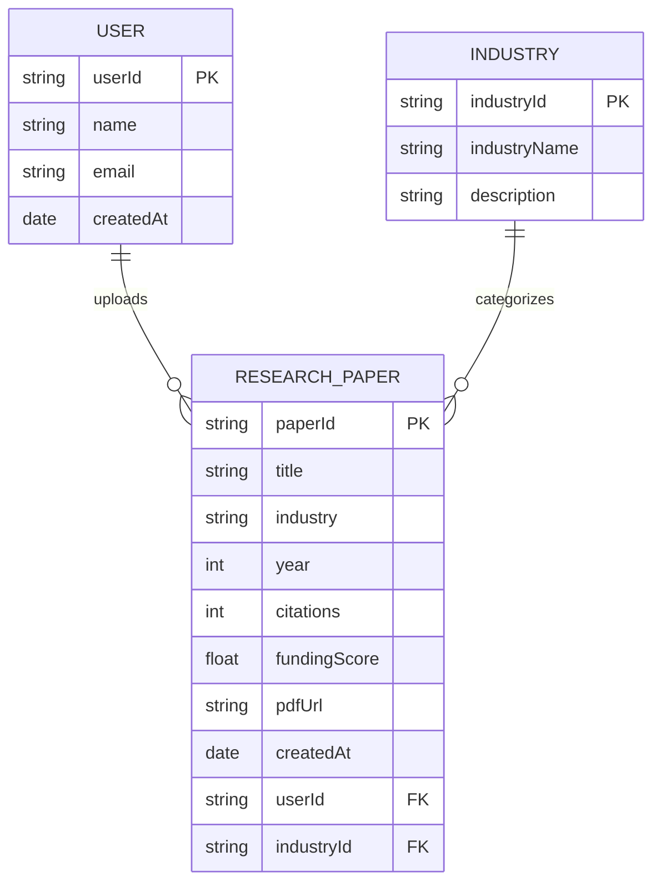

#  ER Diagram – Emerging Market Research Platform

## Entity Relationship Diagram

The ER diagram below represents the database structure for the Emerging Market Research Platform. It defines three core entities — **User**, **Research Paper**, and **Industry** — and the relationships between them.

---

---

##  Entity Descriptions

###  USER
| Attribute   | Type   | Description                          |
|-------------|--------|--------------------------------------|
| `userId`    | String | Primary Key – Unique user identifier |
| `name`      | String | Full name of the user                |
| `email`     | String | Email address (unique)               |
| `createdAt` | Date   | Account creation timestamp           |

###  RESEARCH_PAPER
| Attribute      | Type   | Description                                  |
|----------------|--------|----------------------------------------------|
| `paperId`      | String | Primary Key – Unique paper identifier        |
| `title`        | String | Title of the research paper                  |
| `industry`     | String | Industry category name                       |
| `year`         | Int    | Year of publication                          |
| `citations`    | Int    | Number of citations                          |
| `fundingScore` | Float  | Calculated funding/investment score          |
| `pdfUrl`       | String | Cloud-hosted PDF URL (via Cloudinary)        |
| `createdAt`    | Date   | Upload timestamp                             |
| `userId`       | String | Foreign Key → USER (uploader)                |
| `industryId`   | String | Foreign Key → INDUSTRY (category)            |

###  INDUSTRY
| Attribute      | Type   | Description                            |
|----------------|--------|----------------------------------------|
| `industryId`   | String | Primary Key – Unique industry ID       |
| `industryName` | String | Name of the industry                   |
| `description`  | String | Brief description of the industry      |

---

##  Relationships

| Relationship                  | Type         | Description                                      |
|-------------------------------|--------------|--------------------------------------------------|
| USER → RESEARCH_PAPER         | One-to-Many  | A user can upload multiple research papers        |
| INDUSTRY → RESEARCH_PAPER     | One-to-Many  | An industry can categorize multiple papers        |
