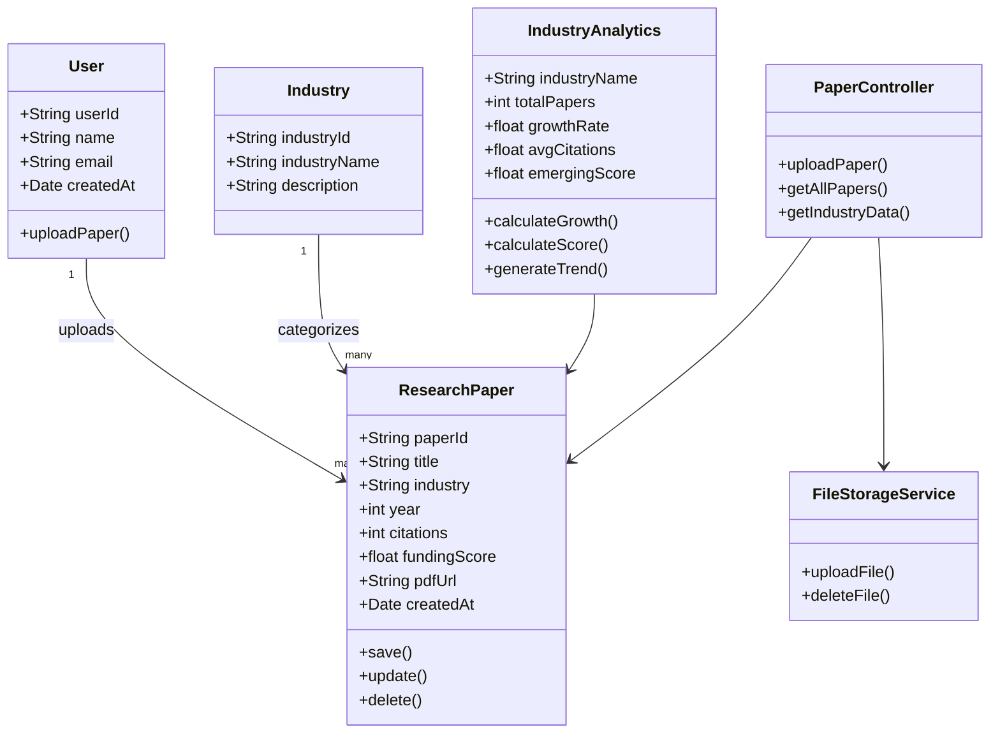

#  UML Class Diagram – Emerging Market Research Platform

## Class Diagram

The class diagram below illustrates the object-oriented structure of the platform, including models, services, and controllers along with their attributes, methods, and relationships.

---

---

##  Class Descriptions

### 🔹 User (Model)
| Member         | Type     | Description                       |
|----------------|----------|-----------------------------------|
| `userId`       | String   | Unique identifier for the user    |
| `name`         | String   | Full name                         |
| `email`        | String   | Email address                     |
| `createdAt`    | Date     | Account creation date             |
| `uploadPaper()`| Method   | Uploads a new research paper      |

###  ResearchPaper (Model)
| Member          | Type     | Description                             |
|-----------------|----------|-----------------------------------------|
| `paperId`       | String   | Unique identifier for the paper         |
| `title`         | String   | Title of the paper                      |
| `industry`      | String   | Industry category                       |
| `year`          | int      | Publication year                        |
| `citations`     | int      | Citation count                          |
| `fundingScore`  | float    | Calculated funding score                |
| `pdfUrl`        | String   | URL of the uploaded PDF                 |
| `createdAt`     | Date     | Upload date                             |
| `save()`        | Method   | Saves the paper to the database         |
| `update()`      | Method   | Updates paper metadata                  |
| `delete()`      | Method   | Deletes the paper                       |

###  Industry (Model)
| Member          | Type     | Description                        |
|-----------------|----------|------------------------------------|
| `industryId`    | String   | Unique identifier for the industry |
| `industryName`  | String   | Name of the industry               |
| `description`   | String   | Brief description                  |

###  IndustryAnalytics (Service)
| Member              | Type     | Description                                 |
|---------------------|----------|---------------------------------------------|
| `industryName`      | String   | Industry being analyzed                     |
| `totalPapers`       | int      | Total papers in the industry                |
| `growthRate`        | float    | Year-over-year growth rate                  |
| `avgCitations`      | float    | Average citations per paper                 |
| `emergingScore`     | float    | Composite emerging market score             |
| `calculateGrowth()` | Method   | Calculates YoY growth rate                  |
| `calculateScore()`  | Method   | Calculates the emerging market score        |
| `generateTrend()`   | Method   | Generates trend data for visualizations     |

###  FileStorageService (Service)
| Member          | Type     | Description                              |
|-----------------|----------|------------------------------------------|
| `uploadFile()`  | Method   | Uploads a PDF file to Cloudinary         |
| `deleteFile()`  | Method   | Deletes a file from Cloudinary           |

###  PaperController (Controller)
| Member              | Type     | Description                              |
|---------------------|----------|------------------------------------------|
| `uploadPaper()`     | Method   | Handles POST /uploadPaper API request    |
| `getAllPapers()`     | Method   | Handles GET /papers API request          |
| `getIndustryData()` | Method   | Handles GET /industryAnalytics request   |

---

## Relationships

| From                | To                  | Type          | Description                                     |
|---------------------|---------------------|---------------|-------------------------------------------------|
| User                | ResearchPaper       | 1 → Many      | A user uploads multiple research papers          |
| Industry            | ResearchPaper       | 1 → Many      | An industry categorizes multiple papers          |
| PaperController     | ResearchPaper       | Dependency     | Controller manages paper CRUD operations         |
| PaperController     | FileStorageService  | Dependency     | Controller uses file storage for PDF uploads     |
| IndustryAnalytics   | ResearchPaper       | Dependency     | Analytics service processes research paper data  |
