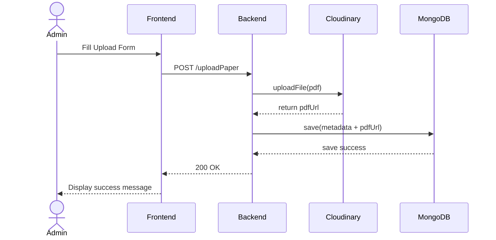
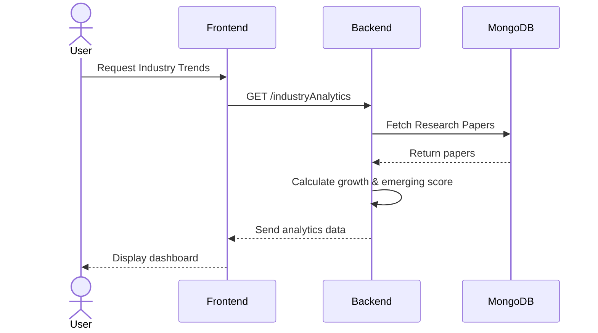

#  UML Sequence Diagrams – Emerging Market Research Platform

##  Upload Flow – Paper Upload Sequence

This sequence diagram illustrates the complete flow when an Admin uploads a research paper, from form submission to cloud storage and database persistence.

---

###  Upload Flow Steps

| Step | Actor / Component | Action                                | Description                                           |
|------|-------------------|---------------------------------------|-------------------------------------------------------|
| 1    | Admin             | Fill Upload Form                      | Admin fills in paper details and selects a PDF file    |
| 2    | Frontend          | POST /uploadPaper                     | Frontend sends form data + PDF to the backend API      |
| 3    | Backend           | uploadFile(pdf)                       | Backend uploads the PDF file to Cloudinary             |
| 4    | Cloudinary        | return pdfUrl                         | Cloudinary stores the file and returns a public URL    |
| 5    | Backend           | save(metadata + pdfUrl)               | Backend saves paper metadata along with pdfUrl to DB   |
| 6    | MongoDB           | save success                          | MongoDB confirms the document was stored successfully  |
| 7    | Backend           | 200 OK                                | Backend responds with a success status to the frontend |
| 8    | Frontend          | Display success message               | Frontend shows a confirmation message to the Admin     |

---

##  Industry Analytics Flow – Data Retrieval & Analysis

This sequence diagram illustrates the flow when a User requests industry trends and analytics, showing how data is fetched, processed, and visualized.

---

###  Analytics Flow Steps

| Step | Actor / Component | Action                               | Description                                                    |
|------|-------------------|--------------------------------------|----------------------------------------------------------------|
| 1    | User              | Request Industry Trends              | User navigates to the analytics/dashboard section              |
| 2    | Frontend          | GET /industryAnalytics               | Frontend sends a GET request to the analytics API endpoint     |
| 3    | Backend           | Fetch Research Papers                | Backend queries MongoDB for all research papers                |
| 4    | MongoDB           | Return papers                        | MongoDB returns the collection of research papers              |
| 5    | Backend           | Calculate growth & emerging score    | Backend processes data — computes growth rate, avg citations, and emerging score |
| 6    | Backend           | Send analytics data                  | Backend sends the computed analytics as JSON to the frontend   |
| 7    | Frontend          | Display dashboard                    | Frontend renders charts, graphs, and trend visualizations      |

---

##  Key Observations

- **Upload Flow** involves external cloud storage (Cloudinary) for PDF files, keeping the database lean by only storing metadata and URLs.
- **Analytics Flow** performs server-side computation to calculate emerging market scores before sending processed data to the frontend.
- Both flows follow a **RESTful API pattern** with clear separation between frontend, backend, and data layers.
