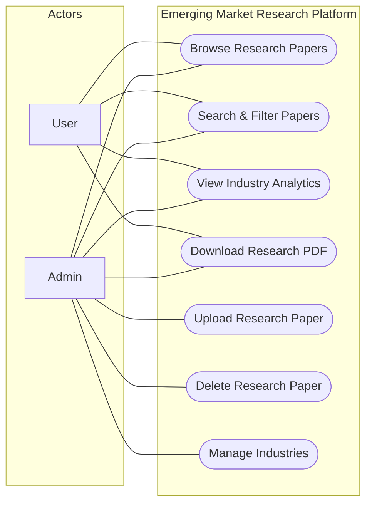

#  UML Use Case Diagram – Emerging Market Research Platform

## Use Case Diagram

The Use Case diagram below describes the functional requirements of the Emerging Market Research Platform by showing the interactions between the and actors the various use cases.

---

---

##  Actor Descriptions

| Actor | Description |
|-------|-------------|
| **User** | A regular consumer of research data who can browse, search, and view analytics. |
| **Admin** | A privileged user responsible for uploading research content and managing platform data. |

---

##  Use Case Descriptions

###  Browse & Search
- **Browse Research Papers**: View a list of all available research papers.
- **Search & Filter Papers**: Find specific papers by title, industry, year, or citation count.

###  Data Consumption
- **View Industry Analytics**: Access dashboards showing growth rates, citation impacts, and emerging scores.
- **Download Research PDF**: Download the original research paper for offline reading.

###  Content Management (Admin Only)
- **Upload Research Paper**: Submit new research PDFs along with their metadata.
- **Delete Research Paper**: Remove outdated or incorrect research entries.
- **Manage Industries**: Add or update industry categories and descriptions.
